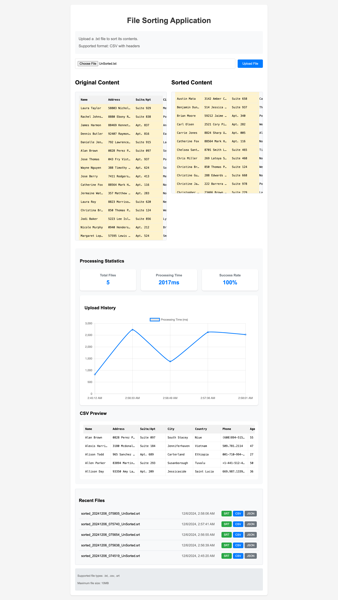
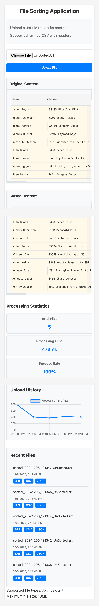

# AWS Lambda File Sorting Application

## Project Overview
A serverless web application that allows users to upload CSV files containing user data, automatically sorts the content by name (first column), and displays the sorted results. Built using AWS Lambda, S3 buckets, and a responsive web interface.

## Features
- Upload CSV files through a web interface
- Real-time progress indication
- Automatic sorting of user data by name
- Error handling and validation
- Mobile-responsive design
- Multi-format export (SRT, CSV, JSON)
- Real-time processing statistics
- File upload history visualization
- CSV data preview with sorting animation
- Automatic history synchronization with S3
- Horizontal scrolling for wide data on mobile
- Sticky headers for better navigation
- Touch-optimized interface for mobile devices
- Responsive design for all screen sizes

## Live Demo
- Frontend URL: http://127.0.0.1:5500/frontend/index.html
- Test Credentials: Not required (uses anonymous access)

## Technical Stack
- **Frontend**: HTML5, CSS3, JavaScript (ES6+), Chart.js
- **Backend**: AWS Lambda (Python)
- **Storage**: AWS S3
- **Authentication**: AWS Cognito (anonymous)
- **Development Tools**: VS Code, AWS Console
- **Version Control**: Git

## Implementation Details
The application includes:
- Real-time data visualization using Chart.js
- Processing statistics dashboard
- File history management with S3 sync
- Multi-format export capabilities
- CSV preview with sorting animations
- Mobile-optimized interface with touch support
- Responsive design with CSS Grid and Flexbox
- Modern CSS features with CSS Variables
- Accessibility features (ARIA labels, semantic HTML)

### Data Visualization Features
- Processing time metrics
- Success rate tracking
- File upload history graph
- CSV data preview
- Sorting animations

### File Management
- Automatic S3 synchronization
- Multiple export formats (SRT, CSV, JSON)
- Real-time history updates
- Last 5 files tracking

### AWS S3 Buckets
- Input Bucket: sortin-nirajan-0921977
- Output Bucket: sortout-nirajan-0921977
- Ensure both buckets have the correct CORS configuration and permissions to allow the Lambda function to read from the input bucket and write to the output bucket.

### AWS Lambda Function: `lambda_function.py`
- is set up to:
  - Trigger on file uploads to the SortIn bucket.
  - Read, sort, and write the file to the SortOut bucket with a .srt extension.

- Processes CSV files containing user data with fields:
  - Name
  - Address
  - Suite/Apt
  - City
  - Country
  - Phone
  - Age
  - Occupation
  - UUID
  - Date of Birth

### Web Interface
- Simple, intuitive upload interface
- Progress bar for upload status
- Sorted results display
- Error messaging system

## Setup Instructions

1. **Clone the Repository**
```bash
git clone [repository-url]
cd [repository-name]
```

2. **Configure AWS Credentials**
- Update `app.js` with your AWS configuration:
```javascript
AWS.config.region = 'ca-central-1';
AWS.config.credentials = new AWS.CognitoIdentityCredentials({
    IdentityPoolId: 'YOUR-IDENTITY-POOL-ID'
});
```

3. **Deploy Frontend**
- Host the following files on a web server:
  - index.html
  - styles.css
  - app.js

4. **Test the Application**
- Open the web interface
- Upload a CSV file
- Wait for processing
- View sorted results

## Usage Example
1. Prepare a CSV or Excel text file with user data
2. Click "Choose File" on the web interface
3. Select your CSV or Excel text file
4. Click "Upload File"
5. Wait for processing (progress bar will indicate status)
6. View the sorted results displayed on the page

## Error Handling
The application handles several error cases:
- Invalid file types
- Empty files
- Network errors
- Processing failures

## Security
- S3 buckets are properly configured with CORS
- Lambda function has minimal required permissions
- Frontend uses temporary credentials via Cognito

## Known Limitations
- Maximum file size: 10MB
- Supports CSV format only
- Sorting is done by first column only

## Troubleshooting
Common issues and solutions:
1. File not uploading
   - Check file format and size
   - Verify AWS credentials
2. Results not displaying
   - Check browser console for errors
   - Verify S3 bucket permissions

## Project Structure
```
project/
├── frontend/
│   ├── index.html
│   ├── styles.css
│   └── app.js
├── lambda/
│   └── lambda_function.py
├── docs/
│   └── README.md
└── aws/
    └── policies/
        ├── cognito-unauth-policy.json
        └── lambda-execution-role.json
```

## AWS Configuration Files

### CORS Configuration for S3 Buckets
```json
{
    "CORSRules": [
        {
            "AllowedHeaders": ["*"],
            "AllowedMethods": ["PUT", "POST", "GET"],
            "AllowedOrigins": ["*"],
            "ExposeHeaders": []
        }
    ]
}
```

## Development Notes
- Frontend uses vanilla JavaScript for simplicity
- Lambda function processes files asynchronously
- Error handling implemented throughout the stack

## Testing
Tested with:
- Various file sizes
- Different CSV formats
- Error scenarios
- Cross-browser compatibility

## Author
- Name: Nirajan Mahara
- Student ID: 0921977

## Support
For issues or questions, please contact:
- Email: c0921977@my.lambton.ca

## Project Status
- Development: Complete
- Testing: In Progress
- Documentation: Complete


## Screenshots

### Screenshot 2024 12 06 At 10.59.04 AM


### Screenshot 2024 12 06 At 10.59.39 AM


### Screenshot 2024 12 06 At 10.59.53 AM


### Screenshot 2024 12 04 At 4.09.33 PM


### Screenshot 2024 12 04 At 4.14.19 PM


### Screenshot 2024 12 05 At 12.57.42 AM


### Screenshot 2024 12 06 At 1.50.22 AM


### Screenshot 2024 12 06 At 1.50.30 AM


### Screenshot 2024 12 06 At 2.13.41 AM


### Cognito Unauth Policy Screenshot 2024 12 04 At 4.03.23 PM


### Custom Policies Screenshot 2024 12 05 At 1.58.23 PM


### Lambda Function And Test Creencapture Ca Central 1 Console Aws Amazon Lambda Home 2024 12 06 00 52 39


### Lambda Function Test Screencapture Ca Central 1 Console Aws Amazon Lambda Home 2024 12 06 00 55 27


### Screencapture 127 0 0 1 5500 Frontend Index Html 2024 12 06 02 59 21


### Screencapture 127 0 0 1 5500 Frontend Index Html 2024 12 06 14 15 05

